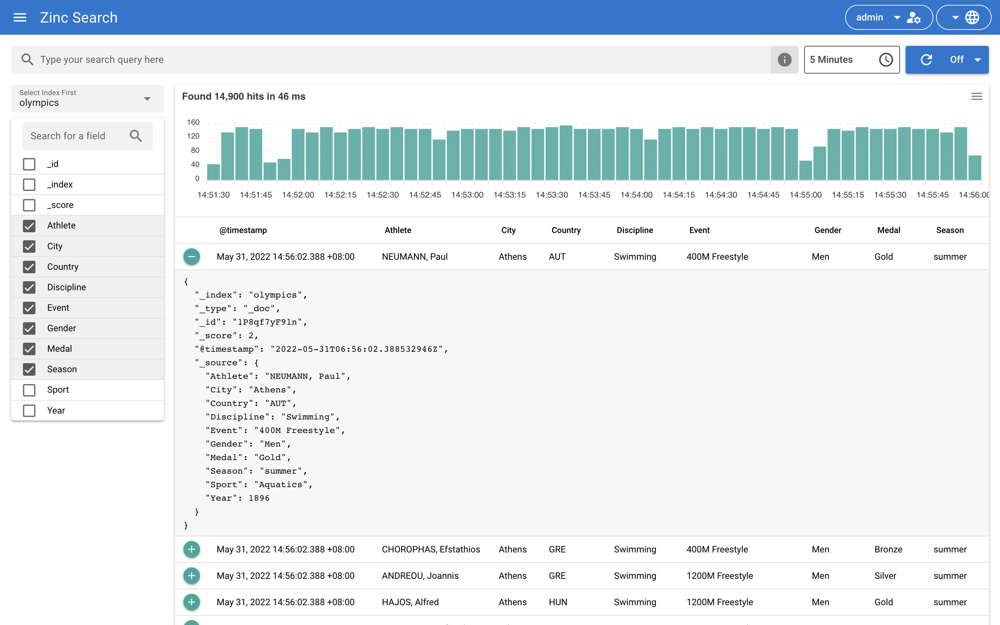
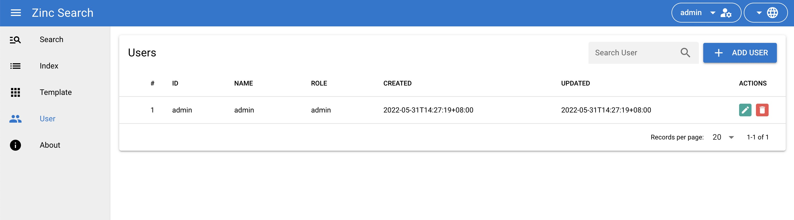

# ZincSearch

ZincSearch is a search engine that does full text indexing. It is a lightweight alternative to Elasticsearch and runs using a fraction of the resources. It uses [bluge](https://github.com/blugelabs/bluge) as the underlying indexing library.

This repository is a public mirror of the ZincSearch project, kept here for reference and experimentation.

It is very simple and easy to operate as opposed to Elasticsearch which requires a couple dozen knobs to understand and tune — you can get up and running in 2 minutes.

It is a drop-in replacement for Elasticsearch if you are just ingesting data using APIs and searching using Kibana (Kibana is not supported with ZincSearch. ZincSearch provides its own UI).

# Why ZincSearch

While Elasticsearch is a very good product, it is complex and requires lots of resources and is more than a decade old. ZincSearch makes full text search indexing easier to use without a lot of work.

# Features

1. Provides full text indexing capability
2. Single binary for installation and running. Binaries available under releases for multiple platforms.
3. Web UI for querying data written in Vue
4. Compatibility with Elasticsearch APIs for ingestion of data (single record and bulk API)
5. Out of the box authentication
6. Schema less - No need to define schema upfront and different documents in the same index can have different fields.
7. Index storage in disk
8. Aggregation support

# Tech stack

- **Go** — backend, single binary
- **Vue** — bundled web UI (`web/`)
- **Bluge** — underlying indexing library

# Documentation

Documentation is available at [https://zincsearch-docs.zinc.dev/](https://zincsearch-docs.zinc.dev/)

# Screenshots

## Search screen



## User management screen



# Getting started

## Quick start

```bash
# Build
./build.sh

# Or run directly with Go
go run ./cmd/zincsearch
```

Then open `http://localhost:4080`. Default credentials: `admin` / `Complexpass#123`. Full guide: [Quickstart](https://zincsearch-docs.zinc.dev/quickstart/)

## Project structure

- `cmd/` — main entry points
- `pkg/` — core server, indexing, API handlers
- `web/` — bundled Vue web UI
- `docs/` — documentation
- `examples/` — API usage examples
- `test/` — tests
- `helm/`, `k8s/` — deployment manifests

## Deploy notes

ZincSearch is a Go server app, not a static site — it needs a Go build or Docker (`Dockerfile` included) plus disk storage, so there is no hosted demo here.

# Releases

ZincSearch has hundreds of production installations.

# ZincSearch Vs OpenObserve

| Feature              | ZincSearch                                                       | OpenObserve                                                                               |
| -------------------- | ---------------------------------------------------------------- | ----------------------------------------------------------------------------------------- |
| Ideal use case       | App search                                                       | Logs, metrics, traces (Immutable Data)                                                    |
| Storage              | Disk                                                             | Disk, Object (S3), GCS, MinIO, swift and more.                                            |
| Preferred Use case   | App search                                                       | Observability (Logs, metrics, traces)                                                     |
| Max data supported   | 100s of GBs                                                      | Petabyte scale                                                                            |
| High availability    | Not available                                                    | Yes                                                                                       |
| Open source          | Yes                                                              | Yes, [OpenObserve](https://github.com/openobserve/openobserve)                            |
| ES API compatibility | Yes                                                              | Yes                                                                                       |
| GUI                  | Basic                                                            | Very Advanced, including dashboards                                                     |
| Cost                 | Open source                                                      | Open source                                                                               |
| Get started          | [Open source docs](https://zincsearch-docs.zinc.dev/quickstart/) | [Open source docs](https://openobserve.ai/docs) or [Cloud](https://cloud.openobserve.ai) |

# Community

- How to develop and contribute to ZincSearch

  Check the [contributing guide](./CONTRIBUTING.md).

# Examples

You can use ZincSearch to index and search any data. Here are some examples that folks have created to index and search enron email dataset using zincsearch:

1. https://github.com/jorgeloaiza48/Enron-Email-DataSet
1. https://github.com/jhojanperlaza/email_search_engine
1. https://github.com/carlosarraes/zinmail
1. https://github.com/devjopa/golab-search
1. https://github.com/avaco2312/zincsearch
1. https://github.com/paolorossig/email-indexer
1. https://github.com/ulimonte05/zincsearching

---

**Built by Girish Lade** — [ladestack.in](https://ladestack.in)
